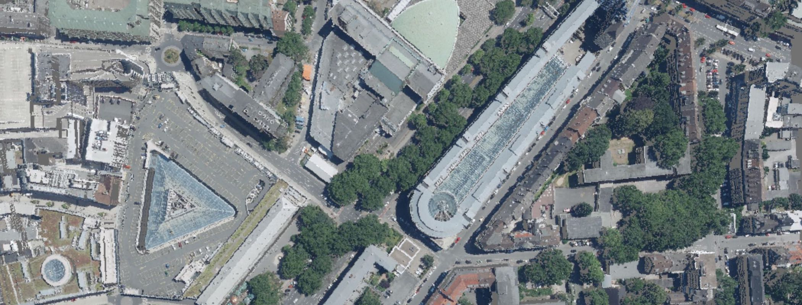
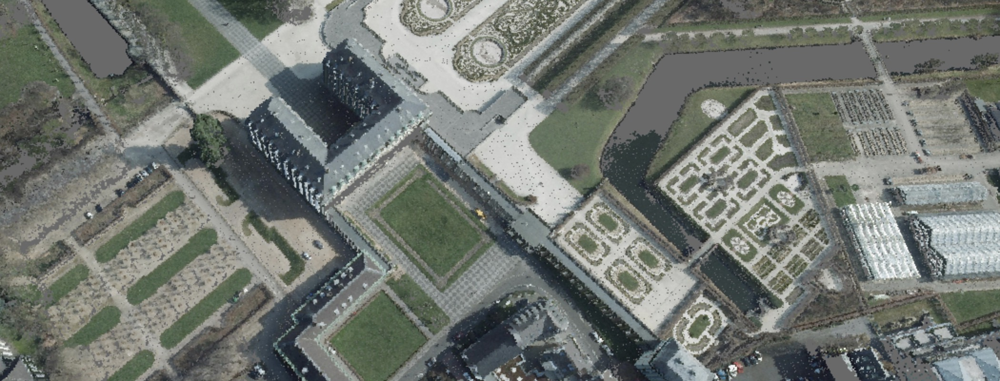

  

This is an interactive web visualisation of the German state of North Rhine-Westphalia's (NRW) open source LIDAR data. I stumbled upon this data during my bachelors thesis and thought this'd be fun for everyone to see. This website was a lot more work than anticipated (what isn't?) and I haven't optimized it much beyond compressing the raw data. I hope you like it!

If you have suggestions and/or like it feel free to contact me or leave a star :).

## What's there to see?
Visit https://nrw.menzinger.io and type in your address to have a look at the colored LIDAR data. Or take a 3D visit to Cologne, Dortmund, Düsseldorf or Essen. Or whatever you place in NRW you like, really. See below for examples.

## About
I processed about 6TB's of LIDAR data (uncompressed) and ~2TB's of orthographic images, split them into 50x50m tiles and mapped a color to each point. It took a while.
The Website itself is relatively lean. The compressed xyz & color data is hosted on Backblaze B2 Cloud in Amsterdam (all other options would probably bankrupt me pretty soon). Depending on coordinates, I fetch the corresponding tiles an visualize the points using threejs. 

# Disclaimer / Info
Keep in mind the data is not perfect:
- The images aren't always from the date the LIDAR data is from, causing some structures to be photographed but not 3D-Scanned and vice versa. 
- Both the LIDAR data and the orthograpic images are collected from vertically above surface, which is why facades are missing
- A couple of square kilometers of data are missing (your odds are ~0,03% of finding one, consider yourself lucky!). I will fix this in the future.

# Examples

## Data
All data is provided under the [dl-de/by-2.0](https://www.govdata.de/dl-de/by-2-0) license by [Land NRW (2020)](https://open.nrw) and can be found on the [Opengeodata.NRW](https://www.opengeodata.nrw.de/produkte/) Platform.
